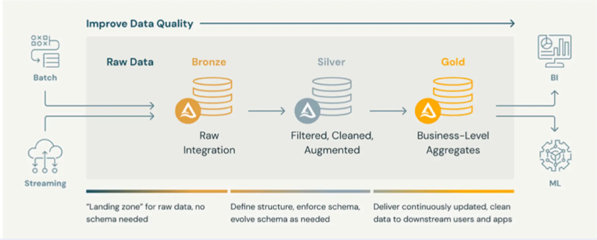
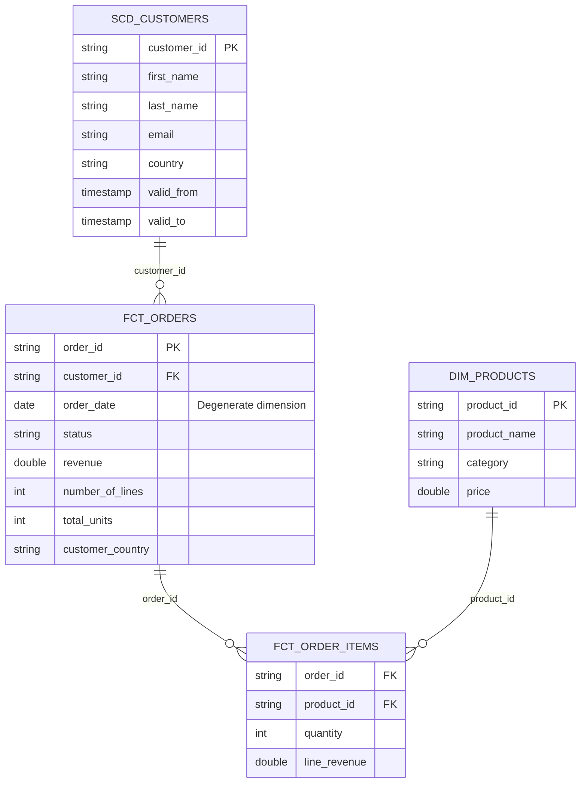

# ShopFlow - dbt + Databricks End-to-End Project

ShopFlow is an e-commerce business (Similar to Takealot or Amazon). Its data is scattered in raw tables, and the business keeps asking three things:

1. What's our revenue?
2. Which products and categories sell best?
3. Who are our best customers?

My job is to build one clean, trusted place where anyone can answer those with a simple query or dashboard, without touching the messy raw data. When you finish, "what's our revenue?" should be one short SQL query against a ready-made table.

---

## The four domain entities

Think of it like this: a customer places an order, the order has order items (lines), and each line is for a product.

- **customers:** who bought
- **products:** what was sold
- **orders:** one purchase event
- **order_items:** the individual lines inside a purchase

---

## The medallion architecture

The design rule is "raw in bronze, logic in silver, business metrics in gold." Think of it as a kitchen:

| Layer | Kitchen analogy | What happens | ShopFlow example |
|---|---|---|---|
| **Bronze** | Groceries delivered | Raw data, exactly as it arrived. No fixing. | The four tables loaded as-is |
| **Silver** | Washed and chopped | Clean and standardize: fix types, rename columns, remove duplicates, handle nulls | Dates become real dates, column names become consistent |
| **Gold** | Plated meal | Business-ready tables built for the questions | Revenue per order, sales per product |

---

## Where dbt (data build tool) fits

In the previous project, Top Cars SA ETL Pipeline, I had to write the SQL in notebooks and run them by hand. dbt does the same job in a more professional way:

- Each transformation is a separate `.sql` file holding one `SELECT`. dbt turns it into a table or view.
- It works out the order to run things, so silver runs before gold.
- I will add tests (no null IDs, no duplicate keys) that run automatically. This is the safety net I wished for when the missing comma dropped the whole column in our previous project.
- It also generates documentation for me, which is awesome by the way.

So dbt handles the "T" (Transform) in the modern ELT (Extract, Load, Transform) data pipeline architecture.

dbt doesn't store or move data. It sends SQL to Databricks, and Databricks does the work.

Sticking to our kitchen analogy: if a data warehouse is a kitchen and raw data is the ingredients, dbt is the recipe book and the head chef. It doesn't buy the ingredients (Extract/Load), but it dictates exactly how to chop, cook, and plate them (Transform) into a perfect meal (the analytics layer) for the business to consume.

---

## New concepts to learn: Grain (Order grain & Line grain)

Grain means what one row in a table represents. If it is wrong, all my numbers will be wrong. The business asks two kinds of questions, so I need two grains.

- **Order grain** (one row per order) answers "how much did this order bring in?", average order value, and orders per week.
- **Line grain** (one row per product in an order) answers "which product or category sells best?" and units sold.

Sticking to my kitchen analogy, this time think of a grocery store receipt:

- The total amount at the bottom is the **Order Grain** (one row per receipt).
- The individual items/veggies listed on the receipt are the **Line Grain** (one row per item purchased).

The receipt totals (Order Grain) are enough to see how much each purchase brought in, but to figure out how many apples/potatoes were sold, the line items (Line Grain) are needed to see the product details.

---

## Data Model (ERD)

**Facts** answer: *"How much?"*
**Dimensions** answer: *"Who, What, When, Where?"*

